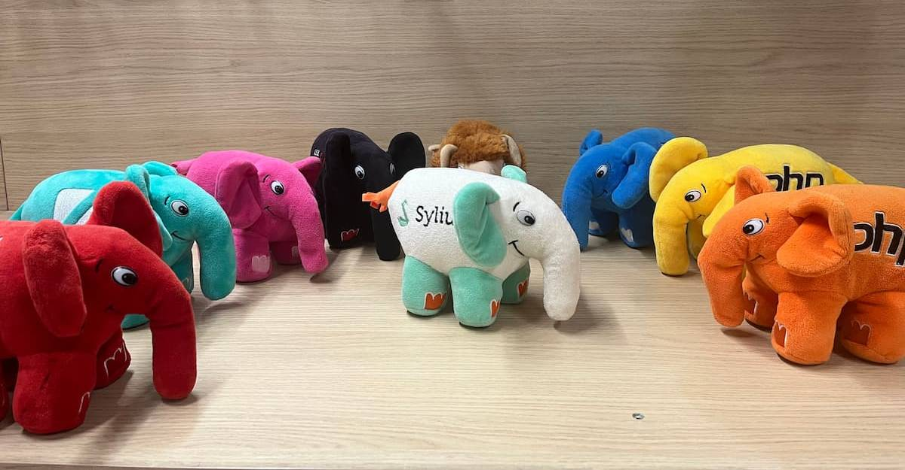

# PHP Annotated——2023 年 11 月

> 英文原版：https://blog.jetbrains.com/phpstorm/2023/12/php-annotated-november-2023/

欢迎来到 PHP Annotated 十一月！在这期中，我们回顾了过去一个月 PHP 社区中最有趣的发展，精选了新闻、文章、工具和视频。

## 亮点

- 🎉 [PHP 8.3.0 发布！](https://www.php.net/releases/8.3/)  
    PHP 8.3 是 PHP 语言的重大更新。包含了一些新功能，例如类型化的类常量、只读属性的深度克隆，以及 random 功能的增强。与往常一样，还包括性能提升、错误修复和常规清理工作。

    要获取 PHP 8.3 中新增内容的详细列表，请查阅[发布页面](https://www.php.net/releases/8.3/)、[迁移指南](https://www.php.net/manual/en/migration83.php)，并在 PHP 基金会的[公告](https://thephp.foundation/blog/2023/11/23/php-83/)中了解有关该版本的更多信息。
    
    **安装或升级到 PHP 8.3**
    
    - Windows：可以在 [windows.php.net](https://windows.php.net/download/) 找到编译后的二进制文件。另外，也可以选择在 [Chocolatey](https://community.chocolatey.org/packages/php) 上提供的社区编译版本。
    - Ubuntu/Debian: PHP 8.3 在 [ondrej/php](https://launchpad.net/~ondrej/+archive/ubuntu/php/) PPA 上可用。
    - Fedora/RHEL/CentOS：在 [Remi 软件仓库](https://blog.remirepo.net/)中，可以作为软件集合（php83）提供。
    - macOS: 可以通过 Homebrew 使用 [shivammathur/homebrew-php](https://github.com/shivammathur/homebrew-php/packages) tap 来安装 PHP 8.3。
    - Docker：PHP 8.3 镜像现在在 [Docker Hub](https://hub.docker.com/_/php) 上 8.3 tag 已可用。  
    [PhpStorm 已经支持 PHP 8.3](https://blog.jetbrains.com/phpstorm/2023/11/phpstorm-now-supports-php-8-3/)。
    
    观看由 Freek、Brent 和 Roman 主持的[庆祝 PHP 8.3](https://www.youtube.com/watch?v=VWryF035B6U) 的直播节目📺。
    
- ⚠️️PHP 8.0 已终止生命周期  
    PHP 8.0.30 标志着这是 PHP 8.0 的最后一个版本。后续将不再接收官方安全更新。
    
- PHP 8.1.26 和 PHP 8.2.13 已发布  
    🐛 这些是 bug 修复版本。

    PHP 8.1 分支将再接收一个版本，PHP 8.1.27，这将是最后一个 bug 修复版本，之后只会发布安全漏洞修复。

- 🎂PHP基金会成立两周年  
    PHP基金会[成立已经两年](https://blog.jetbrains.com/phpstorm/2021/11/the-php-foundation/)了。

    在过去的一年里，PHP 基金会支持了六位[核心开发者](https://thephp.foundation/structure/#core_developers)的工作，并对 PHP 语言做出了重大贡献。

    查看 [PHP 基金会 2023 年 11 月更新](https://thephp.foundation/blog/2023/11/27/php-foundation-update-november-2023/)。

    考虑通过 [OpenCollective](https://opencollective.com/phpfoundation) 或 [GitHub Sponsors](https://github.com/sponsors/thephpf) 来[支持](https://thephp.foundation/donate/) PHP 基金会。

## PHP 核心

大部分核心新闻都在 PHP 基金会的 [PHP 核心摘要系列](https://thephp.foundation/blog/tag/roundup/)中有详细报道，因此这里只会简要提及一些内容：

- 📣 [RFC: Resource 转换到 object](https://wiki.php.net/rfc/resource_to_object_conversion)  
    `resource` 是 PHP 中过时的数据结构，早已被 object 取代。有关 [resource 迁移到 object](https://php.watch/articles/resource-object) 的工作始于 2013 年，但大多数扩展直到 PHP 8.0 发布后才进行了迁移。

    Máté Kocsis 建议迁移剩余的扩展，并制定未来开发的规则。

- 📣 [RFC: 发布周期更新](https://wiki.php.net/rfc/release_cycle_update)  
    目前，PHP 版本的生命周期为 3年。许多人认为这个周期太短，而预发布阶段为期六个月则过长。

    PHP 8.3 的发布经理 Jakub Zelenka 建议将 PHP 版本的生命周期延长至 4 年（维护期2年，安全更新期2年），并对修订预发布阶段。
- 📣 [RFC: 改进 ext/dom 和 ext/xsl 中的 callback](https://wiki.php.net/rfc/improve_callbacks_dom_and_xsl)  
    Niels Dossche建议允许 `XSLTProcessor::registerPHPFunctions()` 和 `DOMXPath::registerPhpFunctions()` 方法使用 `callable`。
- 📣 [RFC: 改变默认如何禁用JIT](https://wiki.php.net/rfc/jit_config_defaults)  
    目前，JIT 以 `tracing` 模式运行，当 `opcache.jit_buffer_size` 设置为 0 时，默认禁用。RFC 建议通过设置 `opcache.jit=disable` 来默认禁用 JIT，并将默认的 `jit_buffer_size` 值增加到 `64m`。
- 📣 [RFC: final 匿名类](https://wiki.php.net/rfc/final_anonymous_classes)  
    该 RFC 提出了三种选择用于改进匿名类的体验：
    1. 新增对 final 匿名类的支持（`new final class {}` 语法，无需进行破坏性更改）。
    2. 默认使所有匿名类为 final 类，不提供使其成为最终类的选项（破坏性更改）。
    3. 默认使所有匿名类为 final 类，并提供可选的 `open` 关键字来使其成为非最终类（类似于 Kotlin 中的 `open class {}`，破坏性更改）。
- 📣 [RFC: 属性钩子](https://wiki.php.net/rfc/property-hooks)  
    该 RFC 中，Ilija Tovillo 和 Larry Garfield 提议使用 get/set 函数声明虚拟属性。
    
    其设计和语法最类似于 [Kotlin](https://kotlinlang.org/docs/properties.html?_gl=1*bgw7l7*_ga*MjA2NTk3MDcyOS4xNjk1MDM1MDc0*_ga_9J976DJZ68*MTcwMTgzOTE5Ni43LjAuMTcwMTgzOTE5Ni42MC4wLjA.&_ga=2.125102793.216207216.1701790268-2065970729.1695035074#getters-and-setters)，尽管也受到了 C# 和 [Swift](https://docs.swift.org/swift-book/documentation/the-swift-programming-language/properties/#Computed-Properties) 的影响。

    ```php
    class User implements Named
    {
        private bool $isModified = false;
     
        public function __construct(private string $first, private string $last) {}
     
        public string $fullName {
            get => $this->first . " " . $this->last;
     
            set($value) => [$this->first, $this->last] = explode(' ', $value);
        }
    }
    ```
    
    该 RFC 的一个有趣副作用是允许在接口中声明抽象属性：
    
    ```php
    abstract class A
    {
        abstract public string $readable { get; }
        abstract protected string $writeable { set; }
        abstract protected string $both { get; set; }   
    }
     
    class C extends A
    {
        public string $readable;
        protected string $readable;
        protected string $writeable {
            set => $field = $value;
        }
        public string $both;
    }
    ```
    
    感谢 [Sjon Hortensius](https://github.com/sponsors/SjonHortensius)，现在可以在 [3v4l.org](https://3v4l.org/) 上尝试属性钩子。

    也可以在 [RFC 投票](https://rfc.stitcher.io/)：[属性钩子](https://rfc.stitcher.io/rfc/property-hooks)上提供反馈意见。

## 工具

- [php-tui/php-tui](https://github.com/php-tui/php-tui)——用于在 PHP 中创建具有伪图形用户界面的控制台应用程序的框架。
- [Crell/Serde](https://github.com/Crell/Serde)——一个强大的适用于 PHP 8 的序列化/反序列化库。
- [pestphp/pest-plugin-stressless](https://github.com/pestphp/pest-plugin-stressless)—— 基于 [grafana/k6](https://github.com/grafana/k6) 构建的 Pest 压力负载测试插件。参见介绍视频📺[Stressless：PHP压力测试](https://www.youtube.com/watch?v=SaMoPZwdOCY)。
- [buggregator/server](https://github.com/buggregator/server)——轻量级的独立服务器，为 PHP 应用程序提供一系列调试功能，包括 XHprof 分析器、Symfony VarDumper 服务器、SMTP 服务器、Sentry 兼容服务器、Monolog 服务器和 HTTP 请求转储服务器。  
- [NoiseByNorthwest/php-spx](https://github.com/NoiseByNorthwest/php-spx)——一个简单且直击要点的 PHP 分析扩展，带有内置的 Web UI。
- [reliforp/reli-prof](https://github.com/reliforp/reli-prof)——一个 PHP 编写的采样分析器或内存分析器，从进程外部读取有关正在运行的 PHP 虚拟机的信息。可以在不更改目标脚本或加载扩展的情况下找到脚本的性能瓶颈或内存泄漏。  
附带 [buggregator/trap](https://github.com/buggregator/trap)——一个控制台迷你服务器和助手，可以更方便地进行PHP调试。
- [saloonphp/xml-wrangler](https://github.com/saloonphp/xml-wrangler)——一个简单的 PHP 库，旨在使 XML 的读写变得容易。另请参阅 [veewee/xml](https://github.com/veewee/xml)——提供了在 PHP 中操心处理 XML 所需工具的包。
- [jolicode/JoliMarkdown](https://github.com/jolicode/JoliMarkdown)—— Markdown 内容的语法修正器。阅读 [JoliMarkdown 介绍](https://jolicode.com/blog/introducing-jolimarkdown-for-a-more-robust-and-rigorous-markdown-content)获取详情。
- [cerbero90/lazy-json](https://github.com/cerbero90/lazy-json)——一个与框架无关的包，用于递归加载任意规模和任意来源的 JSON 文件到 Laravel懒惰集合中。
- [staabm/phpstan-baseline-analysis](https://github.com/staabm/phpstan-baseline-analysis)——分析 PHPStan baseline 文件并创建聚合错误趋势报告。
- [spiral/json-schema-generator](https://github.com/spiral/json-schema-generator)——提供从数据传输对象（DTO）类生成 JSON 模式的能力。

## Symfony

- [Symfony 7](https://symfony.com/7) 发布  
    请查看 [Living on the edge](https://symfony.com/blog/category/living-on-the-edge/7.0-6.4) 列表，了解此版本的新功能。或者查看 Alexander M. Turek 的[你好 Symfony 7](https://slidr.io/derrabus/hello-symfony-7#1) 幻灯片。

    同时发布了 [Symfony 6.4](https://symfony.com/releases/6.4) 和 7.0。这两个版本都包含相同的功能集，但不支持已弃用的功能。

    此外，Symfony 6.4 是长期支持版本，将获得 3 年的错误修复和 1 年的安全漏洞修复。Symfony 7.0 是常规版本，仅支持 8 个月。

- Julien Cousin-Alliot 的[使用 HTMX 和 Symfony 创建单页应用程序](https://jolicode.com/blog/making-a-single-page-application-with-htmx-and-symfony)。

- Smaine Milianni 的 [Symfony 命令重试机制](https://smaine-milianni.medium.com/a-retry-mechanism-for-symfony-commands-15d48f9d4657)。
- [phpyh/service-dumper-bundle](https://github.com/phpyh/service-dumper-bundle)——Symfony 控制台命令去转储依赖注入服务。

## Laravel

- [Laravel Pulse 宣布](https://pulse.laravel.com/)—— Laravel 团队透漏即将免费和开源的工具。将为应用提供关键性能和执行指标的仪表盘。
- [Tinkerwell v4 现已发布](https://tinkerwell.app/whats-new-in-tinkerwell-4)——查看 📺[ Detail Dive](https://www.youtube.com/watch?v=9FBBsnwRWJ4)。
- [MongoDB Laravel 集成现在官方支持](https://www.mongodb.com/blog/post/mongodb-laravel-integration-now-officially-supported)——MongoDB 接管了社区驱动的 Laravel MongoDB 集成开发，使其成为其产品组合中的一等公民。
- Benjamin Crozat 的 [Laravel 如何工作？非常清晰的解释](https://benjamincrozat.com/how-laravel-works)。
- David Carr 的[我编写 Laravel 软件包的过程](https://dcblog.dev/my-process-for-writing-laravel-packages)。
- Jamison Valenta 的[非传统的 Eloquent II](https://muhammedsari.me/unorthodox-eloquent-2)。
- Jamison Valenta 的 [Laravel 的缓存策略](https://tighten.com/insights/overview-of-caching-strategies-in-laravel/)。
- [laravel/pail](https://github.com/laravel/pail)——便于在终端中查看 Laravel 日志的工具。
- [waterholeforum/core](https://github.com/waterholeforum/core)——Laravel 驱动的社区平台/论坛。
- [BookStackApp/BookStack](https://github.com/BookStackApp/BookStack)——一个用 PHP 和 Laravel 构建的创建文档/维基内容的平台。

## 其它框架

- [WordPress 6.4 “Shirley” 发布](https://wordpress.org/news/2023/11/shirley/)

## 杂项

- Jeff Ochoa 的[使用 PHP 枚举的最佳实践](https://jeffochoa.me/php-enums-best-practices)。
- PHP-FIG 的[从 PER-CS v1.0 (PSR-12) 迁移到 PER-CS v2.0](https://github.com/php-fig/per-coding-style/blob/master/migration-2.0.md)。
- Ayesh Karunaratne 的[使用 PHP Curl 扩展发送 HTTP/3 请求](https://php.watch/articles/php-curl-http3)。
- Mark Scherer 的 [Caddy 服务器如何和 PHP 一起使用](https://php.watch/articles/caddy-php)。
- Mark Scherer 的[在 PHP 应用程序中处理小数](https://www.dereuromark.de/2023/11/27/working-with-decimals-in-php-apps/)。
- James Seconde 的[做对类型安全——PHP Array 极客](https://developer.vonage.com/en/blog/type-safety-done-right-php-array-hacking)。
- Markus Staab 的 [Phpstan 过滤 Baseline](https://staabm.github.io/2023/10/30/phpstan-filter-baseline.html)——解决大型 PHPStan baseline 的一种方式。
- [整理的 PHP YouTuber 列表](https://github.com/php-youtubers/directory)。
- Samuel Finixbit 的[在字节码层面自动入侵 PHP Web 应用程序](https://finixbit.github.io/posts/autonomous-Hacking-of-PHP-Web-Applications-at-the-Bytecode-Level/)。
- [Bref 案例研究：Treezor 如何使用 Bref 运行无服务器银行平台](https://bref.sh/docs/case-studies/treezor)——从服务器上运行传统的单一 PHP 服务器，将单一 PHP 放入到 Lambda (又称“Lambda 中的银行”)，然后过渡到微服务。
- Damien Seguy 的[掌握 PHP 中的 (array) 类型转换操作符：全面指南](https://www.exakat.io/en/mastering-the-array-cast-operator-in-php-a-comprehensive-guide/)。
- [WP-Plugin-Architect](https://chat.openai.com/g/g-6cqBCrKTn-wp-plugin-architect)——自定义 (Chat)GPT，可以编写 WordPress 插件，同时特别注意代码安全。
- [Twitter 上的“从朋友那里学到的酷 #gpt 技巧”](https://x.com/VotrubaT/status/1725272310729306346)

## 好玩

- 在 Kickstarter 的众筹活动中，[Sylius 提供他们的 ElePHPant](https://www.kickstarter.com/projects/734475887/sylius-elephpant)。
    [](https://www.kickstarter.com/projects/734475887/sylius-elephpant)
- [最初粉红色的 Elephpant](https://www.vincentpontier.com/elephpant/produit/the-ping-original-legend-numbered-certified/) 现已上市。

## 会议

查看这些即将举行的值得参加的PHP活动，并申请演讲机会：

- [SymfonyCon](https://live.symfony.com/2023-brussels-con/)——比利时布鲁塞尔，2023年12月7-8日。
- [Laracon EU](https://laracon.eu/)——荷兰阿姆斯特丹，2024年2月5-6日。
- [PHP UK](https://www.phpconference.co.uk/)——英国伦敦，2024年2月15-16日。
- [Laracon India](https://laracon.in/)——印度乌代布尔，2024年3月23-24日。[CFP](https://docs.google.com/forms/d/e/1FAIpQLSdHBOswhGtvmrZLaeHDwdnksJ4oHCvNG58oTyC5roTNA99Qjw/viewform)
- [PHP[TEK] 2024](https://tek.phparch.com/)——美国伊利诺伊州芝加哥，2024年4月23-25日。[CFP](https://sessionize.com/phptek-2024)
- [phpday 2024](https://2024.phpday.it/)——意大利维罗纳，2024年5月16-17日。[CFP](https://sessionize.com/phpday-2024)
- [International PHP Conference](https://phpconference.com/berlin-en/)——德国柏林，2024年5月27-31日。 [CFP](https://phpconference.com/call-for-papers/)

如果想知道附近的下一场 PHP 聚会是什么时候，可以通过 [Tomas Votruba](https://twitter.com/VotrubaT) 的 [friendsofphp.org](https://friendsofphp.org/) 聚会聚合网站可以找到答案。[php.net网站上也有日历](https://www.php.net/cal.php)。

----

以上就是今天的全部内容，感谢阅读！