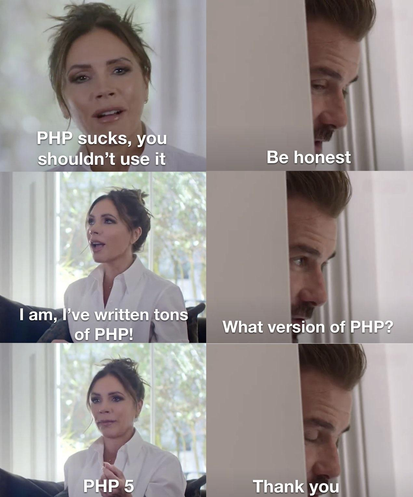

# PHP Annotated——2023 年 12 月

> 英文原版：https://blog.jetbrains.com/phpstorm/2023/12/php-annotated-december-2023/

欢迎来到 PHP Annotated 十二月！在这期中，我们回顾了过去一个月 PHP 社区中最有趣的发展，精选了新闻、文章、工具和视频。

## 亮点

- [PHP 8.1.27](https://www.php.net/ChangeLog-8.php#8.1.27)、[PHP 8.2.14](https://www.php.net/ChangeLog-8.php#8.2.14) 和 [PHP 8.3.1](https://www.php.net/ChangeLog-8.php#8.3.1) 已发布

    🐛这些更新都是修复错误。

    PHP 8.1 分支已经结束其积极支持的阶段，现在只会接收安全修复更新。

- [FrankenPHP 1.0 发布](https://frankenphp.dev/)

    FrankenPHP 是用 Go 编写的现代化 PHP 应用服务器。只需一个命令，就能提供生产级别的 PHP 服务器。内置对 Symfony、Laravel、WordPress 等框架的原生支持。

    请观看 FrankenPHP 的[视频概述](https://youtu.be/q6FQaaFZVy4)。

    [Laravel Octane 现已](https://blog.laravel.com/octane-frankenphp)支持 FrankenPHP。

- [PHP_CodeSniffer 的未来](https://github.com/squizlabs/PHP_CodeSniffer/issues/3932)

    CodeSniffer 的原始维护者决定放弃该项目，但幸运的是，一位著名的社区成员 [Juliette Reinders Folmer](https://twitter.com/jrf_nl) 将开发转移到了一个新的专用组织 [PHPCSStandards](https://github.com/PHPCSStandards/PHP_CodeSniffer)。该工具的工作将在 [PHPCSStandards/PHP_CodeSniffer](https://github.com/PHPCSStandards/PHP_CodeSniffer) 中继续进行。

    Composer 包名目前不会改变；不需要更改依赖关系。

    Juliette 和贡献者们已经发布了 [PHP_CodeSniffer 3.8.0](https://github.com/PHPCSStandards/PHP_CodeSniffer/releases/tag/3.8.0)，其中包含大量增强功能。

    PHP_CodeSniffer 是社区项目并且需要资金支持。如果正在使用它，请考虑赞助维护者：[opencollective.com/php_codesniffer](https://opencollective.com/php_codesniffer)。

- [PhpStorm 2023.3 已发布](https://www.jetbrains.com/zh-cn/phpstorm/whatsnew/2023-3/)

    此重大更新带来了 [AI 助手](https://www.jetbrains.com/zh-cn/ai/)、完整 PHP 8.3 支持、Pest 支持、Symfony 改进以及其它功能。观看快速[视频概述](https://www.youtube.com/watch?v=OgUvH-yLjMI)。

- [Xdebug 3.3.0 已发布](https://xdebug.org/announcements/2023-11-30)

    此版本新增对 PHP 8.3、[火焰图](https://derickrethans.nl/flamboyant-flamegraphs.html)和控制套接字的支持。

    对于火焰图可视化，可以使用 speedscope.app。

## PHP 核心

大部分核心新闻都在 PHP 基金会的 [PHP 核心摘要系列](https://thephp.foundation/blog/tag/roundup/)中有详细报道，因此这里只包含一些简要提及：

- 📣 [RFC: #[NotSerializable]](https://wiki.php.net/rfc/not_serializable)

    Max Semenik 提议新增 `#[NotSerializable]` 注解以防止对类进行序列化。目前，要实现类似的行为，需要在 `__wake()` 和 `__sleep()` 中抛出异常。如果接受此 RFC，代码将更清晰，更适合静态分析器进行分析。

    ```php
    #[NotSerializable]class MyClass
    {
    }
    
    serialize(new MyClass()); // Exception: Serialization of 'MyClass' is not allowed
    ```

- 📣 [RFC: 政策库](https://wiki.php.net/rfc/policy-repository)

    目前，有关 RFC 投票、发布流程、安全等级和命名准则的政策都存储在不同的地方。

    Derick Rethans 提议建立新的 Git 存储库，将所有政策集中到一个地方。

- ❌📣 [RFC: final 匿名类](https://wiki.php.net/rfc/final_anonymous_classes)

    RFC 已驳回，一部分原因是投票问题不明确。    
    反馈后，Daniil Gentili 提出了新的 RFC：[默认 final 匿名类](https://wiki.php.net/rfc/final_by_default_anonymous_classes)。

    建议默认将所有匿名类设置为 final，并在需要时提供新的 `open` 关键字使其成为非 final。这类似于 Kotlin 的 `new open class{}`。该提案被接受的可能性似乎非常低。

- ✅ [RFC: 改变默认如何禁用 JIT](https://wiki.php.net/rfc/jit_config_defaults)

    目前，当 `opcache.jit_buffer_size` 设置为 `0` 时，禁用 JIT。PHP 8.4 将为此设置单独的选项，默认值为：`opcache.jit=disable`。

- [PR: 不带括号的 `new MyClass()->method()`](https://github.com/php/php-src/pull/13029)

    Valentin Udaltsov 建议移除对象初始化表达式中不必要的括号，这在 [X（以前称为“Twitter”）](https://twitter.com/pronskiy/status/1739646806407999653)上引发了激烈的讨论。

- [2024 年将发布新的 PECL](https://twitter.com/ThePHPF/status/1732082795831337402)

    PHP 基金会即将重新设计 PHP 中扩展的安装方式。

    目前，扩展是使用 pecl.php.net 旧网站和 `pecl` 工具分发的。目标是提供一个更易于用户和扩展维护者使用的现代化替代方案。

## 工具

- [staabm/phpstan-todo-by](https://github.com/staabm/phpstan-todo-by)——允许留下带有截止日期的“todo”注释。刚了解到，有些编程语言（如 [Gleam](https://gleam.run/book/tour/todo-and-panic.html)）将 `todo` 作为语言特性提供。

- [spatie/image](https://github.com/spatie/image) v3——使用富有表现力的 API 操作图像。V3 不再依赖 league/glide。Freek Van der Herten 发布了 [Spatie/image 和 Laravel 媒体库的新主要版本](https://freek.dev/2619-new-major-versions-for-spatieimage-and-laravel-media-library-have-been-released)。

- [bpolaszek/bentools-etl](https://github.com/bpolaszek/bentools-etl)—— 遵循 SOLID 原则并且几乎无依赖的 ETL（提取/转换/加载）库。

- [samdark/php-fpm_tuner](https://github.com/samdark/php-fpm_tuner)——根据可用内存、CPU 核心以及 worker 进程消耗的内存来帮助调整 PHP-FPM 配置的脚本。    
该工具的作者有一个很好的 [Telegram 频道](https://t.me/samdark_blog)。在那里了解到 PHP 和其他脚本语言在 Alpine 上比在 Debian 上慢，因为 `musl` 与 `glibc` 内存管理差异。如果你想了解这一点，请看这里：[为什么 Alpine Docker 镜像比 Ubuntu 镜像慢 50% 以上？](https://superuser.com/questions/1219609/why-is-the-alpine-docker-image-over-50-slower-than-the-ubuntu-image)

- [super-linter/super-linter](https://github.com/super-linter/super-linter)——可以作为 GitHub Action 安装的 linter 的组合。如果有多语言项目，这可能很有用。

- [gherkins/regexpbuilderphp](https://github.com/gherkins/regexpbuilderphp)——可读性强的正则表达式生成器。

- [maximal/taran](https://github.com/maximal/taran)——用于对 web 应用程序进行负载测试的简单工具。

- [serversideup/docker-php](https://github.com/serversideup/docker-php) ——为 PHP 准备的生产可用的 Docker 镜像。

- [OrbStack](https://orbstack.dev/)——Docker Desktop 的轻量级替代品。

- [mnapoli/sqlite-s3](https://github.com/mnapoli/sqlite-s3)——无服务器的开发数据库：由 S3 支持的 SQLite。

- [typhoon-php/overloading](https://github.com/typhoon-php/overloading)——为 PHP 实现缺失的方法重载特性。

## Symfony

- Baptiste Leduc 的[使用 Symfony Scheduler 进行主任务调度](https://jolicode.com/blog/master-task-scheduling-with-symfony-scheduler)。
- Javier Eguiluz 的 [Symfony 7 认证简介](https://symfony.com/blog/introducing-the-symfony-7-certification)。
- Ben Roberts 的[在 Symfony 中提高内聚性——将 Twig 模板与代码一起存储](https://medium.com/@benr77/improving-cohesion-in-symfony-storing-twig-templates-with-the-code-7acaee0f420f)。
- Fabien Potencier 的❗️[最后的 Twig 2版本](https://symfony.com/blog/the-last-twig-2-release)。
- [yceruto/bundle-skeleton](https://github.com/yceruto/bundle-skeleton)——推荐用于创建新 bundle 的最小 Symfony bundle。
- [Symfony 2023 年度回顾](https://symfony.com/blog/symfony-2023-year-in-review)。

## Laravel

- Aaron Francis 的[创建自定义 Laravel Pules 卡片](https://aaronfrancis.com/2023/composer-outdated-laravel-pulse)。
- Benjamin Crozat 的 [Laravel 新 Number 助手终极指南](https://benjamincrozat.com/laravel-number-helper)。
- Mater Oussama 的 [Laravel 中的 PHP 注解](https://blog.oussama-mater.tech/php-attributes/)。
- Muhammed Sari [动手实现 decoration](https://muhammedsari.me/hands-on-decoration)。
- Steve McDougall 的 [Laravel 中的 API版本控制：正确操作的完整指南](https://blog.treblle.com/api-versioning-in-laravel-the-complete-guide-to-doing-it-right/)。
- [HPWebdeveloper/laravel-pay-pocket](https://github.com/HPWebdeveloper/laravel-pay-pocket)——具有全面的日志记录和支付功能的多钱包 Laravel 包。
- [rmunate/PHP2JS](https://github.com/rmunate/PHP2JS)——只需一个命令，就可以轻松与外部 JavaScript 文件共享 PHP Laravel 值。
- Jamison Valenta 的 [Laravel 的缓存策略](https://tighten.com/insights/overview-of-caching-strategies-in-laravel/)。
- Josip Crnković 的[直接从客户端上传文件到 S3，而无需将文件放到 Laravel 应用程序中](https://crnkovic.me/uploading-files-directly-from-client-to-s3)。
- Arunas Skirius 的[如何在周末建立 SaaS](https://arunas.dev/how-to-build-a-saas-in-a-weekend/)。
- [cloudstudio/ollama-laravel](https://github.com/cloudstudio/ollama-laravel)——Ollama-Laravel 是 Laravel 包，提供与 Ollama API 的无缝集成。[Ollama](https://ollama.ai/) 可以在本地运行 Llama 2 和其它大型语言模型。
- [laravel-shift/blueprint](https://github.com/laravel-shift/blueprint)——为 Laravel 开发人员提供的代码生成工具。

## 其它框架

- Wilmer Arambula 的[服务定位与依赖注入](https://blog.yii.lat/service-locator-vs-dependency-injection)。
- Wilmer Arambula 的[垂直切片架构](https://blog.yii.lat/vertical-slice-architecture-in-php)。
- Matt Mullenweg 的 [WordPress 2023 回顾](https://wordpress.org/news/2023/12/state-of-the-word-2023-recap/)。

## 杂项

- Bosun Egberinde 的[通过静态 PHP CLI 创建独立的 PHP 应用程序二进制文件](https://www.bosunegberinde.com/articles/building-php-binary)——很高兴看到[这个想法](https://pronskiy.com/blog/php-script-as-binary/)在社区中得到了越来越多的关注。    
FrankenPHP 也允许使用上述相同的方法将 PHP 应用程序打包成单一的二进制文件。
- Kévin Dunglas 的[订阅 HTTP 资源更新的新闻（Mercure、Braid、PREP…）](https://dunglas.dev/2023/11/mercure-braid-prep-news-about-subscribing-to-http-resource-updates/)。
- Alex Xu 的 [2023 年 API 协议的发展前景]()——对 API 的流行路径（approaches）进行了很好的概述：REST、Webhooks、GraphQL、SOAP、WebSocket、gRPC 等。
- Larry Garfield 的[打破 static](https://peakd.com/hive-168588/@crell/cutting-through-the-static)。
- Damien Seguy 的 [Array、class 和匿名类的内存使用情况](https://www.exakat.io/en/array-classes-and-anonymous-memory-usage/)。
- Mark Scherer 的[在 PHP 应用中使用小数](https://www.dereuromark.de/2023/11/27/working-with-decimals-in-php-apps/comment-page-1/)。
- Christian Olear 的[使用匿名类测试抽象类](https://www.otsch.codes/blog/testing-abstract-classes-in-php-using-anonymous-classes)。
- Hamidreza Niazi 的[日志记录层：结构化和持续日志记录教程](https://medium.com/@hamidrezaniazi/logging-layers-a-guide-to-structured-and-consistent-logging-fa6ba41f5f6d)。
- Damien Seguy 的 [PHP 字典](https://php-dictionary.readthedocs.io/en/latest/index.html)——本文档提供了 PHP 生态系统中常用的单词、概念、关键字和表达式的列表，并附有简短的定义和更多资源的额外链接。

-  [Twitter 上的“PHP 枚举真的让我着迷”](https://twitter.com/calebporzio/status/1736762274721698111)

## 好玩

- [Sylius elePHPant 可在 Kickstarter 上预订](https://www.kickstarter.com/projects/734475887/sylius-elephpant)。
- [Twitter 上的“const array array = array() 欢迎来到 #PHP 8.3！”](https://twitter.com/faguo/status/1732488604306346102)
- [Twitter 上的“这是#PHP 8.3 完全兼容的代码。无 @phpstan错误”](https://twitter.com/faguo/status/1732488604306346102)

- 

## 会议

这些 PHP 活动都值得参加（而且可以自由地向其中任何一个活动申请成为演讲者）：

- [Laracon EU](https://laracon.eu/)——荷兰阿姆斯特丹，2024 年 2 月 5 日至 6 日。[CFP](https://docs.google.com/forms/d/e/1FAIpQLScFypq0-07JLgvFylUB6RcmE_0uBqPdte4l-UPNxqbmi7kHBw/viewform)
- [PHP UK](https://www.phpconference.co.uk/)——英国伦敦，2024 年 2 月 15 日至 16 日。[CFP](https://www.papercall.io/phpuk2024)
- [荷兰 PHP 会议](https://www.phpconference.nl/)——荷兰阿姆斯特丹，2024 年 3 月 12 日至 15 日。
- [Laracon India](https://laracon.in/)——印度乌代浦，2024 年 3 月 23 日至 24 日。[CFP](https://docs.google.com/forms/d/e/1FAIpQLSdHBOswhGtvmrZLaeHDwdnksJ4oHCvNG58oTyC5roTNA99Qjw/viewform) 🆕
- [PHP[TEK] 2024](https://tek.phparch.com/)——美国伊利诺伊州芝加哥，2024 年 4 月 23 日至 25 日。[CFP](https://sessionize.com/phptek-2024) 🆕
- [phpday 2024](https://2024.phpday.it/)——意大利维罗纳，2024 年 5 月 16 日至 17 日。[CFP](https://sessionize.com/phpday-2024) 🆕
- [国际 PHP 会议](https://phpconference.com/berlin-en/)——德国柏林，2024 年 5 月 27 日至 31 日。[CFP](https://phpconference.com/call-for-papers/) 🆕

----

PHPers，节日快乐！🎄🐘

如果有任何有趣或有用的链接可以通过 PHP Annotated 分享，请在本文中发表评论或向我们发送[推文](https://twitter.com/pronskiy)。